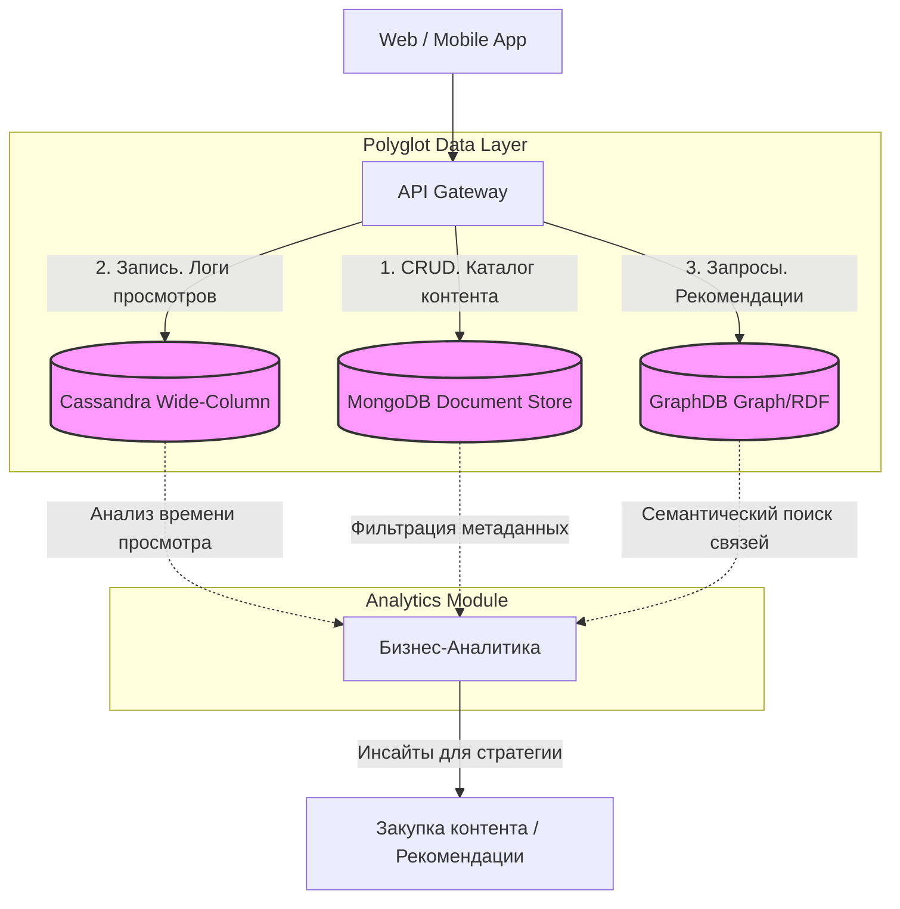

# Отчет по Практической работе №2
## Изучение и применение различных типов NoSQL баз данных на бизнес-кейсах

**Студент:** Трухачев Никита Алексеевич

**Группа:** БД-251м, Магистратура "Бизнес-информатика"

**Вариант:** 30

---

## 1. Введение. Описание бизнес-кейса и архитектуры

### 1.1 Бизнес-кейс
Целью работы является разработка концепта аналитического ядра для стриминговой платформы . Использование одной реляционной СУБД для всех задач неэффективно, поэтому применяется подход **Polyglot Persistence**:

*   **MongoDB (Document Store).** Хранение каталога контента и профилей пользователей. Гибкая JSON-схема позволяет легко добавлять новые атрибуты (новые форматы видео, типы подписок) без миграций схемы.
*   **Cassandra (Wide-Column).** Логирование просмотров (Clickstream). Генерируется огромный непрерывный поток событий (паузы, перемотки, просмотры). Архитектура Cassandra обеспечивает высочайшую скорость записи (High Write Throughput) и линейную масштабируемость.
*   **GraphDB (Graph/RDF).** Построение рекомендательной системы. Графовая БД эффективно обрабатывает сложные многоуровневые связи (Актёр → Фильм → Жанр → Режиссёр), что позволяет находить скрытые закономерности для персонализированных рекомендаций.

### 1.2 Архитектура решения



---
### Обоснование выбора технологий:
- Cassandra для логов: Высокая скорость записи, отказоустойчивость, поддержка временных рядов (CLUSTERING ORDER BY timestamp).
- GraphDB для рекомендаций: Нативный поиск связей через SPARQL, возможность семантического анализа.
- MongoDB для каталога: Гибкая схема, удобство работы с JSON-документами, быстрый доступ по ID.

## 2. Развертывание инфраструктуры
Запуск сервисов выполняется на виртуальной машине через терминал:

```bash
# 1. Запуск MongoDB
cd ~/Downloads/dba/nonrel/mongo 
sudo docker compose down && sudo docker compose up -d

# 2. Запуск Cassandra
cd ~/Downloads/dba/nonrel/cassandra
sudo docker compose down && sudo docker compose up -d

# 3. Запуск GraphDB
cd ~/Downloads/dba/nonrel/graphdb
sudo docker compose down && sudo docker compose up -d
```

---
