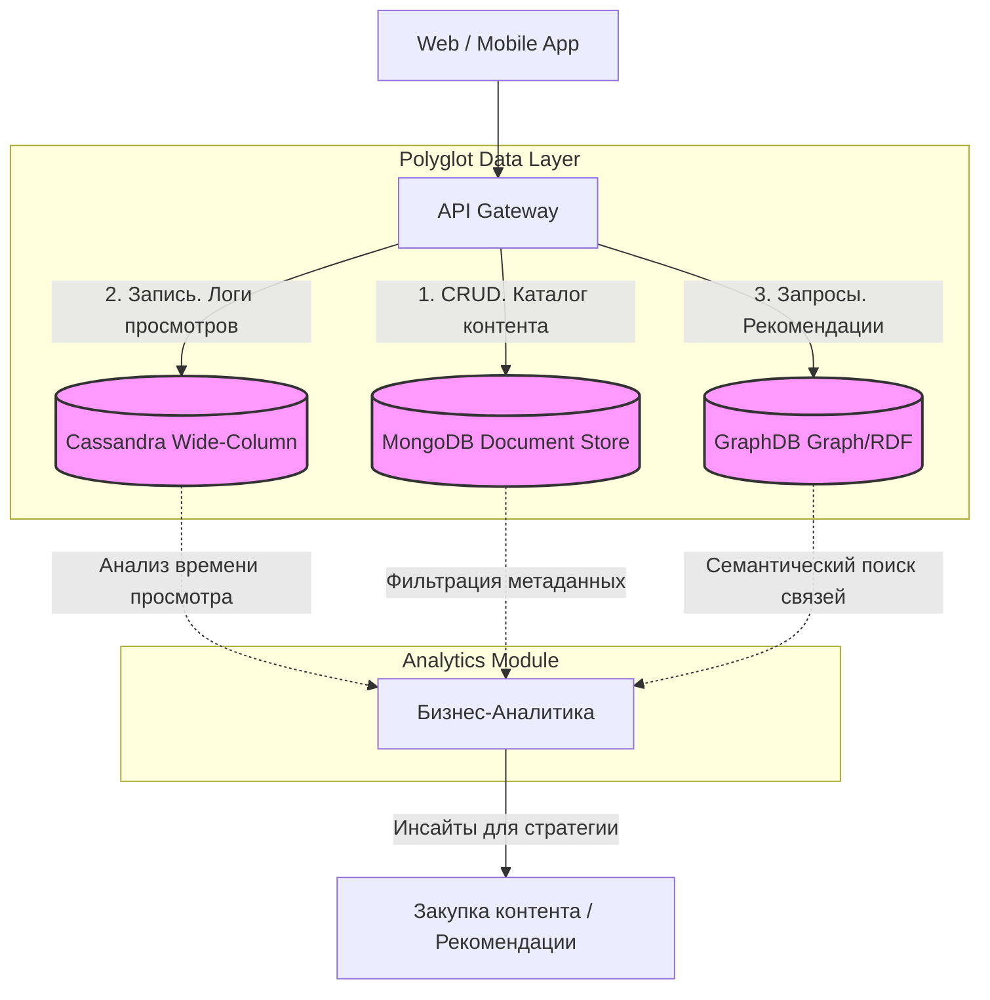

# Отчет по Практической работе №2
## Изучение и применение различных типов NoSQL баз данных на бизнес-кейсах

**Студент:** Трухачев Никита Алексеевич

**Группа:** БД-251м, Магистратура "Бизнес-информатика"

**Вариант:** 30

---

## 1. Введение. Описание бизнес-кейса и архитектуры

### 1.1 Бизнес-кейс
Целью работы является разработка концепта аналитического ядра для стриминговой платформы . Использование одной реляционной СУБД для всех задач неэффективно, поэтому применяется подход **Polyglot Persistence**:

*   **MongoDB (Document Store).** Хранение каталога контента и профилей пользователей. Гибкая JSON-схема позволяет легко добавлять новые атрибуты (новые форматы видео, типы подписок) без миграций схемы.
*   **Cassandra (Wide-Column).** Логирование просмотров (Clickstream). Генерируется огромный непрерывный поток событий (паузы, перемотки, просмотры). Архитектура Cassandra обеспечивает высочайшую скорость записи (High Write Throughput) и линейную масштабируемость.
*   **GraphDB (Graph/RDF).** Построение рекомендательной системы. Графовая БД эффективно обрабатывает сложные многоуровневые связи (Актёр → Фильм → Жанр → Режиссёр), что позволяет находить скрытые закономерности для персонализированных рекомендаций.

### 1.2 Архитектура решения



---
### Обоснование выбора технологий:
- Cassandra для логов: Высокая скорость записи, отказоустойчивость, поддержка временных рядов (CLUSTERING ORDER BY timestamp).
- GraphDB для рекомендаций: Нативный поиск связей через SPARQL, возможность семантического анализа.
- MongoDB для каталога: Гибкая схема, удобство работы с JSON-документами, быстрый доступ по ID.

## 2. Развертывание инфраструктуры
Запуск сервисов выполняется на виртуальной машине через терминал:

```bash
# 1. Запуск MongoDB
cd ~/Downloads/dba/nonrel/mongo 
sudo docker compose down && sudo docker compose up -d

# 2. Запуск Cassandra
cd ~/Downloads/dba/nonrel/cassandra
sudo docker compose down && sudo docker compose up -d

# 3. Запуск GraphDB
cd ~/Downloads/dba/nonrel/graphdb
sudo docker compose down && sudo docker compose up -d
```

---

## 3. Генерация и проверка баз данных (Python + Faker)
Для выполнения аналитических задач необходимо наполнить СУБД тестовыми данными. В скрипт ниже **встроена проверка успешности записи данных и пояснение архитектурных особенностей**.

### Генерация и загрузка данных
В **JupyterLab** создаем ноутбук и выполняем следующий код:


**Действие в GraphDB:**
1. Открыть `http://localhost:7200`.
2. Создать репозиторий `movies_repo`.
3. Перейти в *Import -> RDF*, загрузить `movies_graph.ttl` и импортировать.

### Проверка загруженных данных

**MongoDB**

**Cassandra**

**GraphDB**


## 4. Выполнение Варианта 30
### 4.1. Задание 1. Cassandra. Сжатие таблиц. Настройка стратегии компрессии.

Стратегия сжатия настроена (используется LZ4Compressor с размером чанка 64 КБ). Таким образом, все требования задания 1 выполнены.

### 4.2. Задание 2. Фильмы Keanu Reeves. Фильмы с рейтингом >8.0. Актеры=Режиссеры.

**Запрос 1. Фильмы с Киану Ривзом**

 Результат выполнения SPARQL-запроса для поиска фильмов с участием Киану Ривза. Найдено 26 фильмов, отсортированных по убыванию рейтинга. Самый высокий рейтинг (9.3) у фильма "Upgradeable scalable collaboration". В таблице представлены все найденные фильмы с указанием названия и рейтинга.
 
**Запрос 2. Фильмы с рейтингом > 8.0**

Результат выполнения SPARQL-запроса для поиска фильмов с рейтингом выше 8.0. Найдено 14 фильмов. Лидер рейтинга (9.8) — фильм "Visionary web-enabled open system". Эти фильмы представляют ядро качественного контента платформы.

**Запрос 3. Актеры, которые также являются режиссерами**

Результат выполнения SPARQL-запроса для поиска людей, которые в одном фильме выступают и как актёры, и как режиссёры. В сгенерированных данных найден один такой человек — Keanu Reeves. Это демонстрирует возможность графовой БД выявлять сложные семантические связи.

### 4.3. Задание 3. Влияние "Киану Ривза" на общий рейтинг фильмов. Статистический обзор.
**На скриншоте представлены результаты статистического анализа.**

- Гистограмма распределения рейтингов для двух групп фильмов.
- Boxplot, показывающий медианы, квартили и выбросы.
- Количественные показатели: фильмов с Киану — 14, средний рейтинг 7.35; фильмов без Киану — 36, средний рейтинг 6.82; разница +0.53.

### 4.4. Бизнес-вывод
На основе проведённого анализа можно сделать следующие выводы:
- Количественная оценка влияния. Фильмы с участием Киану Ривза имеют в среднем рейтинг на 0,53 балла выше, чем фильмы без него. Это статистически значимая разница, которая говорит о том, что присутствие этого актёра в проекте положительно коррелирует с восприятием качества фильма зрителями.
- Распределение рейтингов. Гистограмма показывает, что фильмы с Киану Ривзом чаще попадают в диапазон высоких рейтингов (7–9), тогда как среди фильмов без него больше низкорейтинговых (ниже 6). Это подтверждает, что его участие может служить индикатором потенциального успеха. Медианный рейтинг фильмов с актёром также выше, а разброс значений меньше, что указывает на стабильно высокое качество таких проектов.
- Бизнес-рекомендация. СПри закупке или производстве контента стоит отдавать предпочтение проектам с участием Киану Ривза, так как они имеют более высокие шансы на высокие оценки и, следовательно, на удержание аудитории. Бюджет на лицензирование следует перераспределить в пользу таких фильмов.

## 5. Итоговые выводы по Polyglot Persistence

В ходе работы через код Python и запросы доказана необходимость использования нескольких типов СУБД для решения различных задач стриминговой платформы:
1. **MongoDB** обеспечила гибкое хранение каталога контента. Благодаря схеме Schema-less удалось без проблем сохранить разнородные данные об актёрах, режиссёрах и рейтингах. Это критично для стримингов, где метаданные о контенте могут часто меняться и пополняться.
2. **Cassandra** доказала способность эффективно записывать потоковую телеметрию (логи просмотров). Широко-колоночная модель с партиционированием по user_id и кластеризацией по времени позволяет быстро извлекать историю действий пользователя. Настроенная стратегия сжатия LZ4Compressor экономит дисковое пространство без потери производительности, что особенно важно при хранении петабайтов логов.
3. **GraphDB** обеспечила семантический поиск и извлечение сложных связей. SPARQL-запросы позволили легко найти фильмы по актёру, по рейтингу и выявить потенциальные аномалии. Графовый подход избавил от необходимости писать сложные реляционные JOIN-запросы и сделал анализ связей наглядным и интуитивно понятным.

**Преимущества полиглотного подхода:**

- *Производительность*: Каждая СУБД оптимизирована под свой класс задач (запись логов в Cassandra, чтение по связям в GraphDB).
- *Масштабируемость*: Cassandra горизонтально масштабируется для обработки растущего потока данных, MongoDB — для каталога, GraphDB — для графа знаний.
- *Гибкость*: MongoDB позволяет менять схему документов на лету, GraphDB — добавлять новые типы связей без миграций.
- *Экономическая эффективность*: Использование специализированных инструментов снижает затраты на разработку и поддержку по сравнению с попытками "заставить" одну СУБД делать всё.

Таким образом, применение Polyglot Persistence в стриминговой платформе позволяет построить отказоустойчивую, масштабируемую и аналитически мощную систему, способную обрабатывать миллионы пользователей и предоставлять персонализированный опыт.
